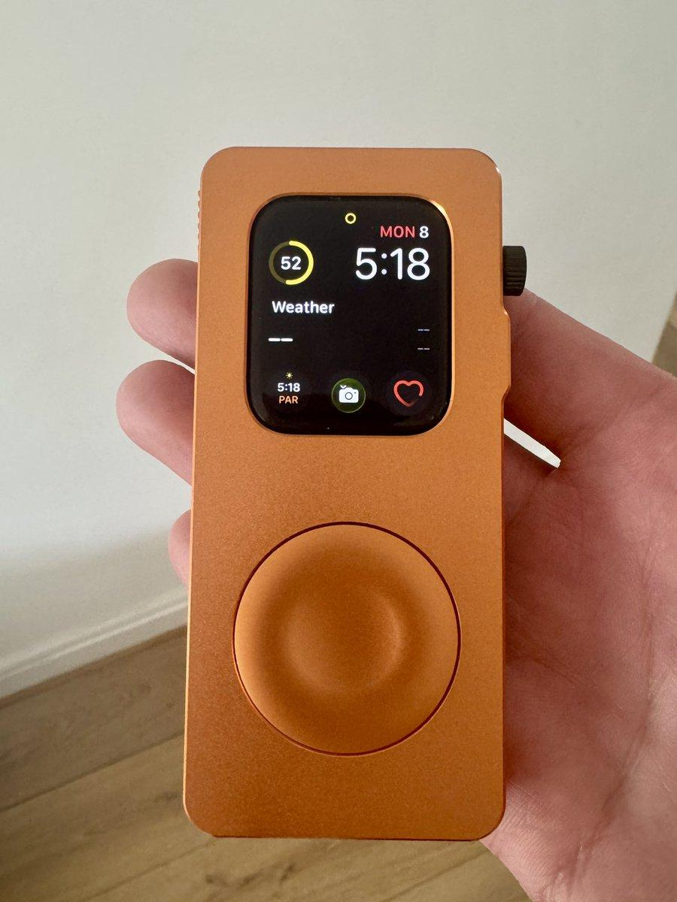
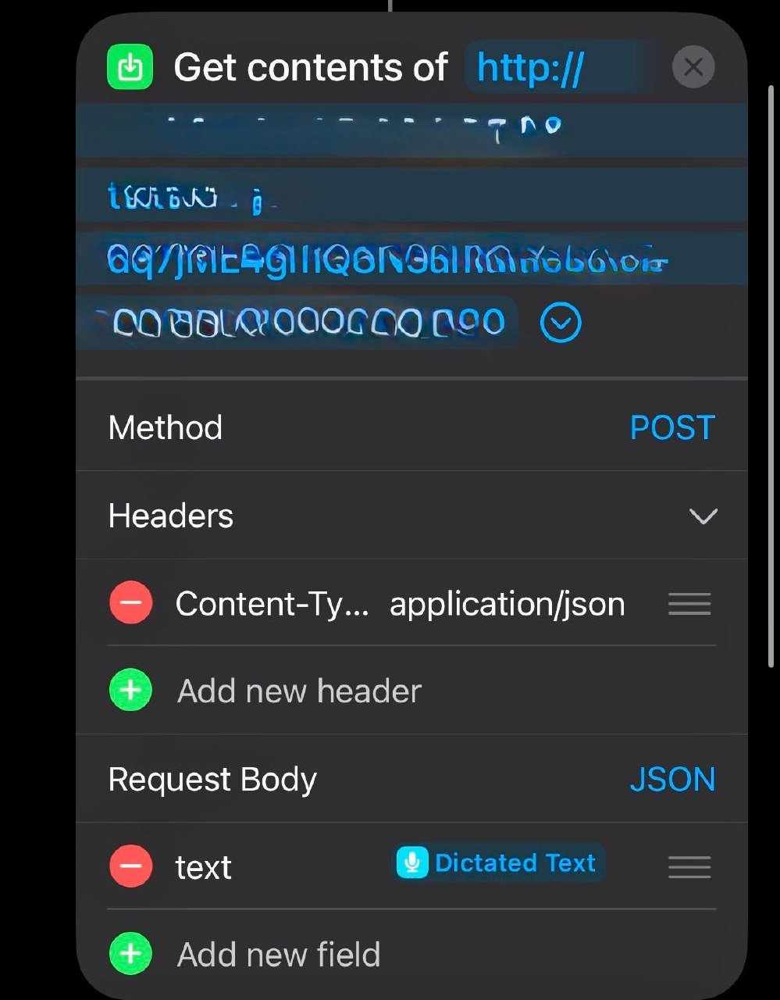
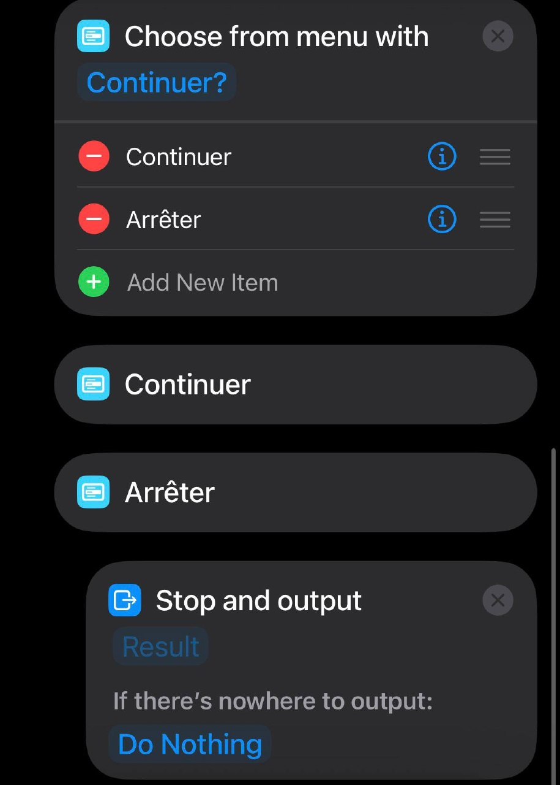
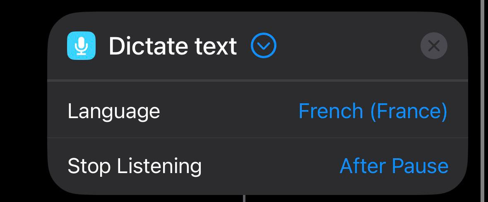
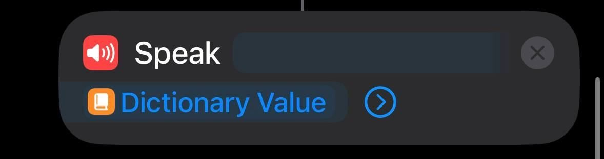
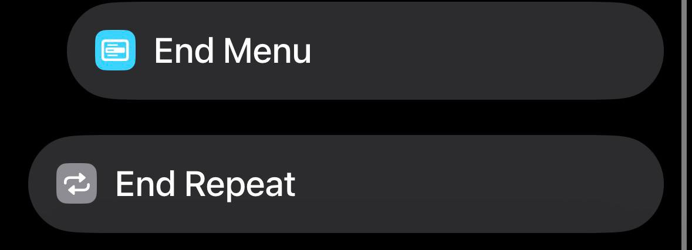

# Siri Watch RePod: Hermes On The Go

<p>
  
</p>

Turn an Apple Watch in a RePod-style carry case into a tiny Siri gateway for Hermes.

This repo documents a lightweight Apple Shortcuts flow: speak to Siri on the watch, send the dictated request to a Hermes endpoint, then hear or read the answer back without pulling out a phone or laptop.

The goal is simple: Hermes, on the go.

> Not affiliated with Apple, Siri, Apple Watch, Hermes, Hermes Paris, or RePod. Product names are used only to describe the workflow.

## Field Note

I now use this setup as a voice-first interface to Hermes through Siri, and it works surprisingly well. It also runs directly from the iPhone.

The iOS Shortcut connects to my Hermes + Obsidian stack with a dedicated API `POST` request, giving me agentic behavior and memory from my wrist. I added a repeat loop so Siri asks after every answer whether I want to continue or stop.

To launch it, I tap the automation like an app or simply say:

```text
Siri, Hermes
```

Siri asks for my first prompt, Hermes answers out loud, and the conversation can continue hands-free. In my setup, the spoken answer uses the Thomas voice.

For travel, the value is immediate capture: launching automations on the spot, starting a project, saving an idea, or noting something exactly when it appears. I press the Digital Crown on the watch in the case, speak, and Hermes captures it.

Moving from writing to voice is powerful, but it takes a little practice. This shortcut is my way to make that shift feel natural.

## Visual Gallery

More reference images for the Siri, Apple Watch, RePod-style carry, and shortcut setup.

<p>
  
  
</p>

<p>
  
</p>

<p>
  
</p>

<p>
  
</p>

<p>
  
</p>

## What You Need

- Apple Watch paired with an iPhone
- Apple Shortcuts app on iPhone
- A reachable Hermes endpoint
- Optional: a tunnel or public HTTPS endpoint if Hermes is running on your home machine

## Shortcut Overview

The shortcut does this:

1. Siri listens on Apple Watch.
2. The shortcut captures your dictated request.
3. The shortcut sends the request to Hermes with `Get Contents of URL`.
4. Hermes returns a text answer.
5. Apple Watch speaks or displays the answer.

## Step 1: Prepare Your Hermes Endpoint

Expose a Hermes endpoint that accepts a text prompt and returns a text response.

Example endpoint:

```text
https://your-domain.example/hermes
```

Expected request body:

```json
{
  "message": "Your dictated request from Siri"
}
```

Expected response body:

```json
{
  "reply": "Hermes response text"
}
```

If Hermes runs locally, use a secure tunnel so your iPhone and Apple Watch can reach it over HTTPS.

## Step 2: Create the Shortcut

On your iPhone:

1. Open **Shortcuts**.
2. Tap **+** to create a new shortcut.
3. Name it **Hermes On The Go**.
4. Tap the shortcut icon and choose a simple watch-friendly icon.

## Step 3: Add Dictation

Add the first action:

1. Search for **Dictate Text**.
2. Add it to the shortcut.
3. Set **Language** to your preferred language.
4. Keep **Stop Listening** set to **After Pause**.

This is the message Siri will send to Hermes.

## Step 4: Build the JSON Body

Add a **Text** action after **Dictate Text**.

Paste this:

```json
{
  "message": "DICTATED_TEXT"
}
```

Then replace `DICTATED_TEXT` with the magic variable from **Dictated Text**.

In Shortcuts, the value should appear as a variable token, not plain typed text.

## Step 5: Send the Request

Add **Get Contents of URL**.

Configure it like this:

- **URL:** your Hermes endpoint
- **Method:** `POST`
- **Headers:**
  - `Content-Type`: `application/json`
  - `Authorization`: `Bearer YOUR_TOKEN` if your endpoint requires one
- **Request Body:** `File`
- **File:** the JSON **Text** action from the previous step

If your endpoint does not use authentication, remove the `Authorization` header.

## Step 6: Extract the Reply

Add **Get Dictionary from Input**.

Then add **Get Dictionary Value**:

- **Key:** `reply`
- **Dictionary:** the response from **Get Contents of URL**

This pulls the Hermes answer out of the JSON response.

## Step 7: Speak the Answer on Apple Watch

Add **Speak Text**.

Set the text to the `reply` value from the previous step.

Recommended settings:

- **Wait Until Finished:** on
- **Rate:** normal
- **Pitch:** normal

Optional: add **Show Result** after **Speak Text** if you also want the answer displayed on the watch screen.

## Step 8: Enable Apple Watch

On iPhone:

1. Open the shortcut settings.
2. Enable **Show on Apple Watch**.
3. Enable **Use with Siri** if available.
4. Confirm the shortcut appears in the Apple Watch Shortcuts app.

## Step 9: Run It With Siri

On Apple Watch, say:

```text
Hey Siri, Hermes On The Go
```

Then dictate your request.

Example:

```text
Summarize my next task and tell me the first action.
```

Siri sends it to Hermes, and Hermes answers back on the watch.

## Optional: Faster Command Phrases

Create duplicate shortcuts with shorter names:

- **Ask Hermes**
- **Hermes Now**
- **Watch Hermes**
- **Go Hermes**

Short names are easier to trigger reliably from Apple Watch.

## Optional: Add a Mode Field

If your Hermes endpoint supports modes, add one to the JSON body:

```json
{
  "message": "DICTATED_TEXT",
  "mode": "watch"
}
```

Use the `watch` mode server-side to keep responses short, direct, and easy to hear.

## Troubleshooting

If Siri says the shortcut failed:

1. Test the shortcut from the iPhone first.
2. Confirm the endpoint uses HTTPS.
3. Confirm the endpoint is reachable outside your local network.
4. Check that the JSON body is valid.
5. Check that the response includes a top-level `reply` field.
6. If using a token, confirm the `Authorization` header is correct.

If the response is too long:

1. Add a server-side watch mode.
2. Ask Hermes to answer in one or two sentences.
3. Add a **Text** action before the request that wraps your dictation with:

```text
Answer for Apple Watch in two short sentences: DICTATED_TEXT
```

## Recommended Watch Prompt

Use this as the server-side instruction for watch requests:

```text
You are Hermes on Apple Watch. Answer clearly, briefly, and action-first. Prefer one to three short sentences. Avoid long lists unless the user asks for steps.
```

## Minimal Endpoint Contract

Request:

```http
POST /hermes
Content-Type: application/json
Authorization: Bearer optional-token
```

```json
{
  "message": "What should I do next?"
}
```

Response:

```json
{
  "reply": "Start with the highest-impact task, then check your calendar before committing to anything else."
}
```
